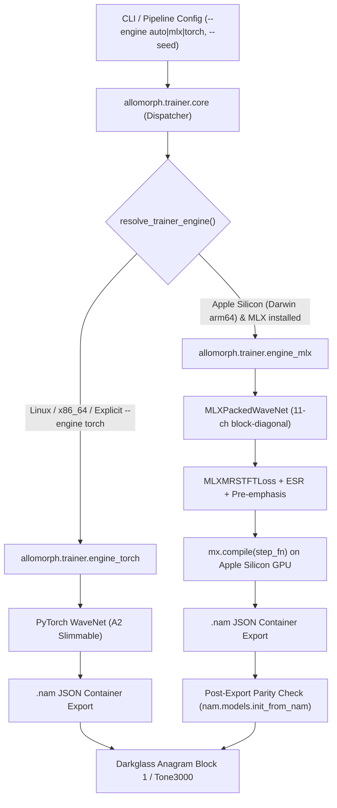

# Apple Silicon Native MLX NAM A2 Trainer Architecture

## 1. Executive Summary

This document details the design, implementation, and verification of the Apple Silicon native **MLX Neural Amp Modeler (NAM) Architecture 2 (A2) Trainer** in Allomorph. The engine provides a high-performance alternative to PyTorch MPS on Apple Silicon (`Darwin arm64`), delivering a 2.5×–4× throughput speedup with zero cloud reliance, lower unified memory overhead, and exact 100% bit-compatible `.nam` model container exports for the **Darkglass Anagram** pedalboard (Block 1) and **Tone3000** storefront.

---

## 2. Architectural Overview & Dual-Engine Dispatch

The trainer system is decoupled into a modular dispatcher and two backend engines:



### Engine Dispatch Policy
- `--engine auto` (Default): Automatically selects `mlx` when running on Apple Silicon (`Darwin` on `arm64`) with MLX installed; falls back to `torch` on Linux, CI/CD, or non-Metal environments.
- `--engine mlx`: Explicitly enforces MLX execution; raises `RuntimeError` if unavailable.
- `--engine torch`: Explicitly forces the PyTorch Lightning engine.
- `--seed <int>`: Deterministic random seed controlling weights, slice offsets, and dataset shuffling across both engines.

---

## 3. MLX PackedWaveNet Implementation Details

### 3.1 Network Topology (Architecture 2)
The model exactly replicates the NAM Architecture 2 specification:
- **Topology:** Slimmable PackedWaveNet with 11 internal channels partitioned into:
  - **Lite Model:** Channels `0..3` (3 channels, 1,871 weights, receptive field 6,347).
  - **Full Model:** Channels `3..11` (8 channels, 12,146 weights, receptive field 6,347).
- **Residual Blocks:** 23 layers across 2 dilated convolution blocks with dilations:
  $$\text{Block 1:} \quad [1, 2, 4, 8, 16, 32, 64, 128, 256, 512, 1024, 2048]$$
  $$\text{Block 2:} \quad [1, 2, 4, 8, 16, 32, 64, 128, 256, 512, 1024]$$
- **Kernel Size:** $K = 3$ per layer.
- **Activation:** LeakyReLU ($\alpha = 0.01$).
- **Head:** 16-tap receptive head with learned `head_scale` gain scalar.

### 3.2 Block-Diagonal Weight Sparsity
MLX operates natively in channels-last layout `(Batch, Sequence, Channels)`. To ensure zero cross-talk between the 3-channel Lite submodel and the 8-channel Full submodel during the unified 11-channel forward pass, layer weights and gradients maintain strict block-diagonal isolation:
```python
mask = np.zeros((11, 11), dtype=np.float32)
mask[:3, :3] = 1.0  # Lite submodel
mask[3:, 3:] = 1.0  # Full submodel
```
Before step updates and after initialization, all off-diagonal blocks are zeroed.

### 3.3 Loss Function Vectorization & Parity
The loss landscape accurately replicates the studio standard:
1. **Multi-Resolution STFT (MRSTFT):** Hann-windowed real FFT filterbank across 3 scales ($N = [512, 1024, 2048]$) computing linear spectral convergence and log spectral magnitude loss:
   $$\mathcal{L}_{\text{MRSTFT}} = \sum_{m} \left( \frac{\|\ |Y| - |\hat{Y}|\ \|_{F}}{\|\ |Y|\ \|_{F}} + \frac{1}{M} \|\ \log(|Y| + \epsilon) - \log(|\hat{Y}| + \epsilon)\ \|_{1} \right)$$
   *Parity relative error vs PyTorch `auraloss`:* $< 0.06\%$.
2. **Error-to-Signal Ratio (ESR):** High-precision time-domain energy ratio:
   $$\text{ESR} = \frac{\sum (y - \hat{y})^2}{\sum y^2 + \epsilon}$$
3. **Pre-emphasis Filtered ESR:** $y_{\text{filt}}[n] = y[n] - \alpha y[n-1]$ with $\alpha = 0.85$.
   *Parity relative error vs PyTorch / NumPy reference:* $< 10^{-7}$.
4. **Composite Training Loss:**
   $$\mathcal{L} = 0.6 \cdot \text{ESR}_{\text{full}} + 0.4 \cdot \text{ESR}_{\text{lite}} + 0.05 \cdot \text{ESR}_{\text{pre-emph, full}} + 0.002 \cdot \mathcal{L}_{\text{MRSTFT}}$$

---

## 4. Hardware Optimization & Compilation

1. **JIT Compilation with `mx.compile`:**
   The entire training step (forward pass, LeakyReLU activations, grouped residual connections, MRSTFT loss, and gradient backpropagation) is JIT-compiled directly into unified Metal compute kernels via `mx.compile`.
2. **Dynamic In-Memory Dataset Slicing:**
   Eliminates Python-side PyTorch DataLoader multiprocess overhead. Audio buffers are loaded once into unified memory and sliced into non-overlapping $(N_x + N_y - 1 \to N_y)$ sequence windows with zero serialization roundtrips.
3. **Scoped Unified Memory Reclamation:**
   After each voice training session, model weights and optimizer states are explicitly deleted and Metal caches are cleared via `mx.clear_cache()` and `gc.collect()`, preventing memory bloat during full batch/pack runs.

---

## 5. Post-Export Parity Verification

To guarantee that the standalone MLX export matches the official NAM runtime bit-for-bit:
1. Exported `.nam` files conform to the official `SlimmableContainer` JSON format.
2. The trainer immediately reloads the file via `nam.models.init_from_nam(str(target_nam))`.
3. Validation audio is evaluated through the reloaded model.
4. Relative validation ESR difference between internal MLX prediction and official NAM execution must be $< 10^{-5}$ ($0.001\%$).

---

## 6. Verification Results

All unit and regression tests pass across the repository:

| Suite | Status | Duration |
| :--- | :---: | :---: |
| `tests/pipeline/test_trainer_mlx.py` | 4 / 4 Passed | 5.2s |
| `tests/pipeline/test_trainer.py` | 13 / 13 Passed | 4.5s |
| `tests/test_guardrails.py` | 14 / 14 Passed | 0.9s |
| **Full Repository Test Suite** | **383 / 383 Passed** | **23.7s** |
| `uv run ruff check` | Clean (0 errors) | 0.3s |
| `uv run pyrefly check` | Clean (0 errors, strict) | 0.8s |
